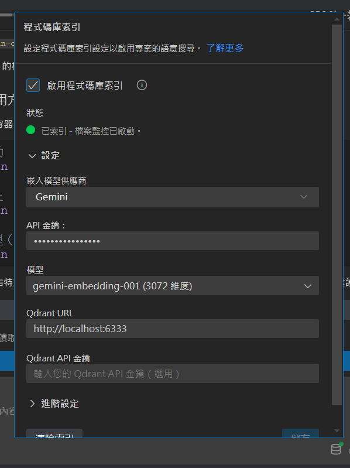

# AITool.CSharp.Practice - Semantic Kernel 專案

這個專案展示如何在 .NET 8 中使用 Microsoft Semantic Kernel 與 OpenAI 服務。

## 🚀 快速開始

### 1. 安裝相依套件

專案已包含以下套件：

- `Microsoft.SemanticKernel` (v1.64.0)
- `Microsoft.SemanticKernel.Agents.Core` (v1.65.0)
- `Microsoft.SemanticKernel.Connectors.Google` (v1.64.0-alpha)
- `Microsoft.Agents.AI.OpenAI` (v1.0.0-preview.251009.1)
- `Microsoft.ML.Tokenizers` (v1.0.0)
- `Microsoft.ML.Tokenizers.Data.Cl100kBase` (v1.0.0)
- `Microsoft.ML.Tokenizers.Data.O200kBase` (v1.0.0)
- `Microsoft.Extensions.Configuration` (v9.0.9)
- `Microsoft.Extensions.Configuration.Json` (v9.0.9)
- `Microsoft.Extensions.Configuration.EnvironmentVariables` (v9.0.9)
- `Microsoft.Extensions.Configuration.UserSecrets` (v9.0.9)
- `Microsoft.Extensions.DependencyInjection` (v9.0.9)
- `Microsoft.Extensions.Hosting` (v9.0.9)
- `Microsoft.Extensions.Logging.Console` (v9.0.9)
- `OpenTelemetry.Exporter.Console` (v1.12.0)
- `OpenTelemetry.Exporter.OpenTelemetryProtocol` (v1.12.0)
- `OpenTelemetry.Instrumentation.Http` (v1.12.0)
- `OpenTelemetry.Instrumentation.Runtime` (v1.12.0)

## 使用 uv 安裝 Python環境

```
uv pip install -r AITool.CSharp.Practice/Python/requirements.txt --prerelease=allow
```

### 2. 設定 OpenAI API 金鑰

#### appsettings.Development.json

修改 `appsettings.Development.json` 檔案，將 `ApiKey` 替換為你的 OpenAI API 金鑰。
建議使用 Secret Manager 來管理敏感資訊。

```json
{
  "OpenAI": {
    "ApiKey": "透過 Secret Manager 設定",
    "Model": "gpt-4.1-nano"
  }
}
```

### 3. 執行專案

```bash
dotnet run --project AITool.CSharp.Practice
```

### 4. OpenAI Model 選擇

請參考 [OpenAI Models 比較文件](https://platform.openai.com/docs/models/compare)

# 📝 TODO - Semantic Kernel 學習歷程規劃

## 1. 基礎

- [x] 1.1 使用 OpenAI SDK (熟悉 API 呼叫)
- [x] 1.2 建立簡單聊天範例
- [x] 1.3 使用 [CSnakes](https://github.com/tonybaloney/csnakes) 執行 [tiktoken](https://github.com/openai/tiktoken) 計算
  Token 數量
- [x] 1.4 計算 Token 數量 SK 官方使用 Microsoft.ML.Tokenizers (支援 GPT-4.1-nano, GPT-4, GPT-4o)
- [x] AITool.CSharp.Practice\Python\ 目錄下建立 Python 範例
    - [x] 建立 token_counter.py > count_tokens 函式
    - [x] 使用 sample_token_counter.py 測試

## 2. Semantic Kernel 基礎

- [x] 2.0 聊天整合 (OpenAI → GitHub Model)
    - [x] 2.0.1 基本聊天回傳必須使用自定義的 C# Model
    - [x] 2.0.2 使用 SemanticKernel + OpenAI API 讀取文章並由 LLM 生成 10 筆 Q&A
- [x] 2.1 聊天 (Conversation)
- [x] 2.2 聊天 記憶歷史對話 (Conversation History)
    - [x] 2.2.1 Reducer (多輪對話總結 / 減量)
        - [x] 2.2.1.1 保留前 x 次對話 (Truncation)
        - [x] 2.2.1.2 摘要前 x 次對話 (Summarization)
- [x] 2.3 OpenAI Function Calling
- [X] 2.4 Gemini Function Calling

## 3. Agent 設計

- [x] 3.1 基本 Agent
- [x] 3.1 基本 Agent + Function Calling

## 4. AutoGen 範例 (多 Agent 協作)

https://microsoft.github.io/autogen/stable/user-guide/agentchat-user-guide/index.html

- [x] 4.0 [AutoGen] 先改使用 Agent-Framework 實作，未來應該都會使用另外一套

```csharp
<PackageReference Include="Microsoft.AutoGen.Contracts" Version="0.4.0-dev.3" />
<PackageReference Include="Microsoft.AutoGen.Core" Version="0.4.0-dev.3" />
<PackageReference Include="Microsoft.AutoGen.AgentChat" Version="0.4.0-dev.3" />
<PackageReference Include="Microsoft.AutoGen.Agents" Version="0.4.0-dev.3" />
<PackageReference Include="Microsoft.AutoGen.Extensions" Version="0.4.0-dev.3" />
```

- [x] 4.1 [AutoGen]  基本範例，建立 Python 版本

## 5.  Agent-Framework

https://github.com/microsoft/agent-framework

- [x]  5.1 [Agent-Framework]  建立 C# 基本範例
- [x]  5.2 [Agent-Framework]  建立 Python 基本範例 (使用 devUI，但目前標記為失敗，改為直接使用 dotnet 版本)


## 5. RAG (檔案 & 外部知識)

- [ ] 5.0 建立 Qdrant Docker 環境
- [ ] 5.1 整合 Semantic Kernel + Qdrant
- [ ] 5.2 PDF → 向量化 & 查詢
- [ ] 5.3 Markdown → 向量化
- [ ] 5.4 股票新聞 RAG 檢索

### Qdrant

Kilo Code 可以使用 Qdrant 讀程式

https://kilocode.ai/docs/features/codebase-indexing

#### 安裝 Qdrant

```
podman run -d --name qdrant -p 6333:6333 -p 6334:6334 -v qdrant_storage:/qdrant/storage qdrant/qdrant:latest
docker run -d --name qdrant --restart=always -p 6333:6333 -p 6334:6334 -v D:/Docker/qdrant_storage:/qdrant/storage qdrant/qdrant:latest
```



#### 進入 Dashboard

http://localhost:6333/dashboard

## 6. 股票顧問應用

- [ ] 6.0 混合式 Agent
    - [ ] 股票顧問 Agent (讀取 MSSQL 大盤資料)
    - [ ] 新聞檢索 Agent (RAG + Qdrant)
    - [ ] 使用者對話 Agent (整合 system prompt + 記憶)
- [ ] 7.1 MSSQL → Agent 自動讀取每日收盤價
- [ ] 7.2 移動平均線策略 (回測)
- [ ] 7.3 布林帶策略 (回測)
- [ ] 7.4 混合式決策 Agent (技術指標 + 新聞情緒)

## 9. Microsoft.Extensions.AI.Evaluation 評估機制

## 10. Opentelemetry 觀察性

[.NET Aspire + Semantic Kernel](https://www.youtube.com/watch?v=0N8-NHjcG1U)
[microsoft semantic-kernel ](https://learn.microsoft.com/zh-tw/semantic-kernel/concepts/enterprise-readiness/observability/telemetry-with-console?tabs=Powershell-CreateFile%2CEnvironmentFile&pivots=programming-language-csharp)

- [x] 加入 Tracing

### Aspire Dashboard

> 因為 Aspire 預設沒有處理 Unicode 所以還是使用 Grafana + Tempo 看結果。

[獨立 .NET.NET Aspire 儀錶板](https://learn.microsoft.com/zh-tw/dotnet/aspire/fundamentals/dashboard/standalone?tabs=bash#start-the-dashboard)

```
podman run -it -d -p 18888:18888 -p 4317:18889 --name aspire-dashboard mcr.microsoft.com/dotnet/aspire-dashboard:latest
```

### Langfuese + Sermantic Kernel

1. 安裝 Docker 環境，自己 clone Langfuse 專案 執行 `docker-compose up -d`
   https://github.com/langfuse/langfuse?tab=readme-ov-file#self-host-langfuse

參考官方文件
https://langfuse.com/integrations/frameworks/semantic-kernel

1. 實作 builder.Services.AddLangfuseOpenTelemetry();
2. 登入 Langfuse 建立專案 取得 PublicKey & SecretKey

```json
  "Langfuse": {
    "SecretKey": "sk-lf-d77acb00-67ea-4dba-9850-ba55f7c2cda9",
    "PublicKey": "pk-lf-40e5c2b9-8edc-4276-9d98-b176671f2e25",
    "Host": "http://localhost:3000/api/public/otel/v1/traces"
  }
```

---

實作多文檔檢索功能。

**參考資料：** [相關教學影片](https://www.youtube.com/watch?v=ujgf9g4ajus)

---

## 🔗 相關連結

- [Microsoft Semantic Kernel 官方文件](https://learn.microsoft.com/en-us/semantic-kernel/)
- [OpenAI API 文件](https://platform.openai.com/docs)
- [Qdrant 向量資料庫](https://qdrant.tech/)
- [GitHub Models Playground](https://github.com/marketplace/models)
 
